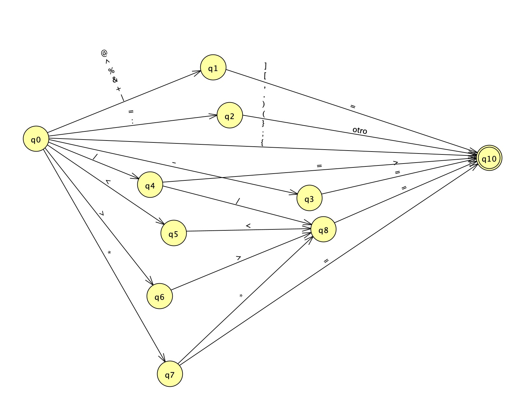

# Compilador Python Simplificado  

Esto es un proyecto de un compilador simple de python desarrollado para la materia de compiladores e intérpretes de la Universidade de Santiago de Compostela en el grado de Ingeniería Informática (2ª edición).


## Tabla de Contenidos
- [Compilador Python Simplificado  ](#compilador-python-simplificado--)
  - [Tabla de Contenidos](#tabla-de-contenidos)
  - [Estructura del Proyecto](#estructura-del-proyecto)
  - [Características](#características)
  - [Compilación](#compilación)
  - [Uso](#uso)
  - [Automátas](#automátas)
    - [Delimitadores](#delimitadores)
    - [Operadores](#operadores)
    - [Strings](#strings)
    - [Ints](#ints)
    - [Floats](#floats)

## Estructura del Proyecto

El proyecto se estructura en varios componentes clave, organizados en directorios específicos para facilitar su manejo y comprensión:

- **analizadorLexico/**: Contiene el código fuente del analizador léxico, responsable de descomponer el código fuente en tokens léxicos.
- **analizadorSintactico/**: Alberga el analizador sintáctico, que construye el árbol sintáctico a partir de los tokens proporcionados por el analizador léxico.
- **sistemaEntrada/**: Gestiona la entrada de datos al compilador, leyendo el código fuente desde un archivo.
- **tablasHash/**: Implementa una tabla de hash utilizada para el almacenamiento y recuperación eficiente de tokens durante el análisis.
- **tablaSimbolos/**: Administra la tabla de símbolos, esencial para el seguimiento de las entidades del lenguaje.
- **gestionErrores/**: Proporciona funcionalidades para el reporte de errores encontrados durante el análisis del código fuente.
- **definiciones.h**: Define constantes y estructuras globales usadas a lo largo del proyecto.

## Características

El compilador presenta las siguientes características:
- **Análisis Léxico**: Descompone el texto de entrada en una serie de tokens, identificando los componentes léxicos del lenguaje.
- **Análisis Sintáctico**: Construye un árbol sintáctico que representa la estructura gramatical del código fuente basado en los tokens identificados.
- **Gestión de Errores**: Reporta errores de sintaxis y léxicos de manera clara y concisa.
- **Tabla de Símbolos**: Realiza el seguimiento de identificadores y otras entidades del lenguaje.
- **Flexibilidad**: Diseñado para ser extendido y adaptado a otros lenguajes o subconjuntos de lenguajes.

## Compilación

Para compilar el proyecto, asegúrate de tener instalado [GCC](https://gcc.gnu.org/) en tu sistema. El proyecto incluye un `Makefile` que simplifica el proceso de compilación.

Sigue estos pasos para compilar el proyecto:

1. Abre una terminal.
2. Navega al directorio raíz del proyecto.
3. Ejecuta el comando `make`.

Esto generará el ejecutable en el directorio `bin/` del proyecto.

## Uso

Para utilizar el compilador con un archivo de código fuente, sigue estos pasos:

```
./bin/miCompilador wilcoxon.py
```

## Automátas

### Delimitadores



### Operadores


### Strings


### Ints


### Floats


---

Gracias por visitar y explorar este proyecto de compilador Python Simplificado. Esperamos que este readme te haya sido de utilidad para entender tanto el uso del proyecto como su estructura. 